# 1. 실습 환경 구축

절차는 다음과 같이 진행됩니다.

1.  하드웨어 요구사항

2.  Windows 운영체제 컴퓨터에 가상머신 프로그램 VMware를 설치

     - VMware Workstation 15 Player 설치

3.  VMware로 가상드라이브를 만들어서, 리눅스 운영체제 설치

    -   Red Hat Enterprise Linux 8 사용

## 0. 하드웨어 요구사항

-   RAM 메모리 적어도 8GM

-   가상화 지원 검사 : [securable](<https://securable.softonic.kr/>)

Hardware Virtualization 이 Yes라고 표시되어 있어야 함

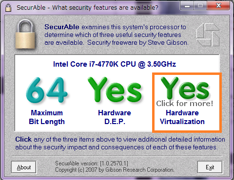

-   아래처럼 No라고 표시된 경우 두 가지 경우를 생각 할 수 있음

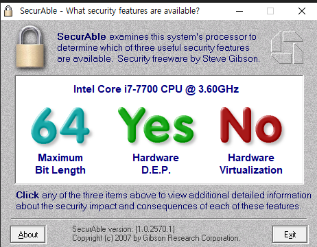

 

1.  해결이 가능한 상황 : CMOS 접속하여, 내 PC에 가상화(VT) 활성화가
    가능한 경우

> [CPU VT 활성화 방법(CPU
> 가상화)](<https://seogilang.tistory.com/271>)
>
> 참고 : 메인보드 제조사에 따라서 CMOS 접속 방법이 다릅니다. 제조사 확인
> 후 CPU VT 활성화 방법을 검색해보세요.

-   메인보드 제조사 확인 방법

> [cpu-z 다운](<https://www.cpuid.com/softwares/cpu-z.html>)

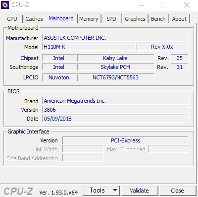
 

1.  해결이 불가능한 상황 : Virtual 기능을 지원하지 않는CPU일 경우 (이건
    하드웨어의 문제로, 메인보드를 바꾸던지 컴퓨터를 바꿔야함)

> 확인 방법(제조사가 인텔인 경우) : [인텔 프로세서 식별
> 유틸리티](<https://downloadcenter.intel.com/ko/download/28539/Intel-Processor-Identification-Utility-Windows-Version>)

-   아래 내용을 보면 Intel VT-x 미지원인 것을 볼 수 있음. 이건
    하드웨어를 바꿔야지 해결이 안됨... (학원 컴퓨터가 그래서 컴퓨터를
    바꿨습니다.)

-   [자세한 내용은 인텔 홈페이지에 확인 가능](
    https://www.intel.co.kr/content/www/kr/ko/support/articles/000005486/processors.html)

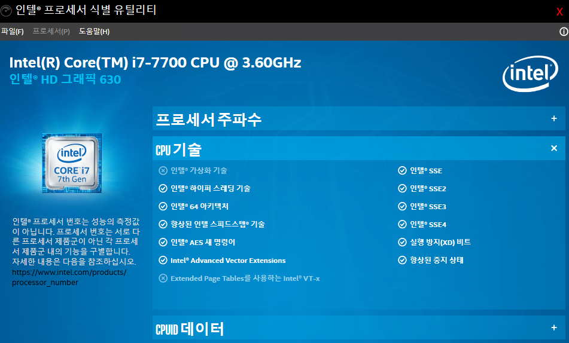

## 1. Windows 운영체제 컴퓨터에 가상머신 프로그램 VMware를 설치

-   [VMware Workstation 15 Player
    설치](<https://www.vmware.com/kr/products/workstation-player/workstation-player-evaluation.html>)

-   [참고] : VMware Workstation Pro 는 한달 사용 무료(스냅샷 기능
    지원)이고, VMware Workstation Player는 "개인용으로 사용하는 경우
    무료"

-   다운 시 업데이트, join 체크 두개 풀고 다운(편의상 자동 업데이트
    거절)

 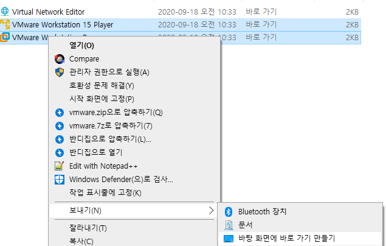

## 2. VMware로 가상드라이브를 만들어서, 리눅스 설치

### 첫번째 가상 드라이브. Server

- 리눅스 운영체제, GUI 환경

 이것이 리눅스다 20p 참고

 가상드라이브 만들면서 리눅스설치 할건지 여부

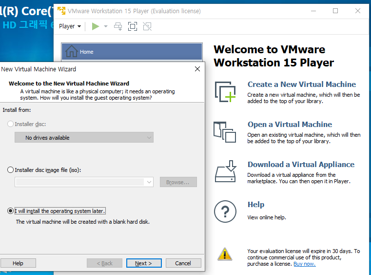

 리눅스 깔기

 Red Hat Enterprise Linux 8 다운

 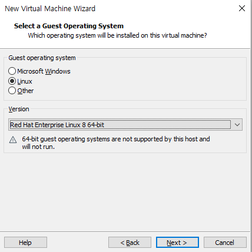

 Server 폴더에 Server 가상 드라이브 생성

 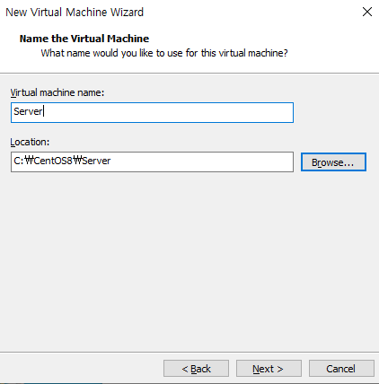

 그대로

 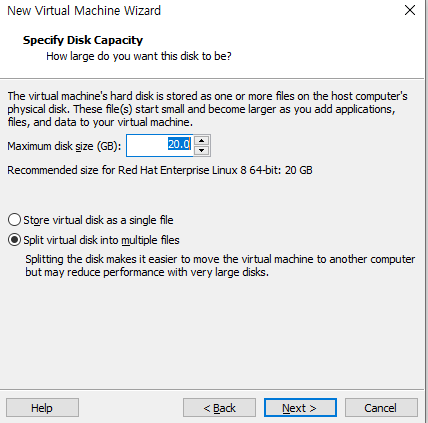

 Edit Virtual Machine Setting 클릭 (39p 참고)

 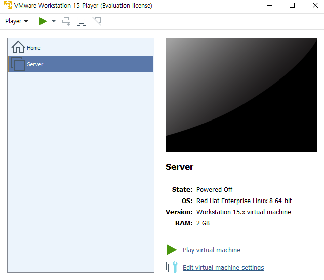

 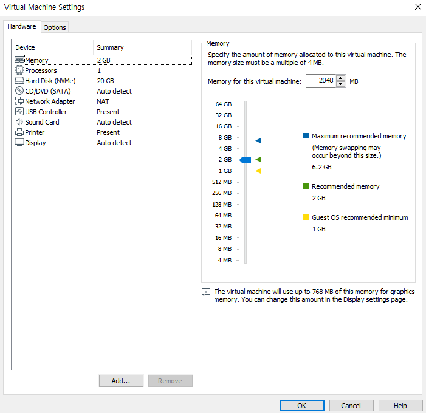

 하드디스크를 보면 현제 크기, 최대 크기 등을 볼 수 있음

 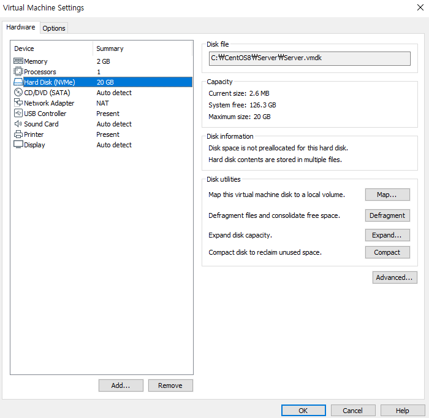

 Remove 한뒤 Add Harddisk

 SCII

 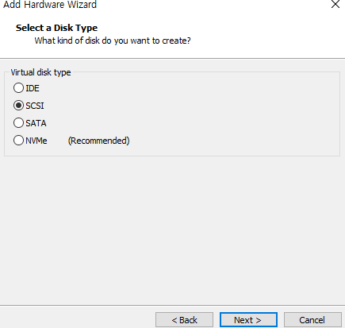

 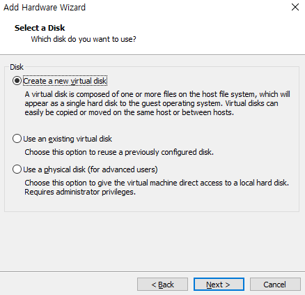

 80

 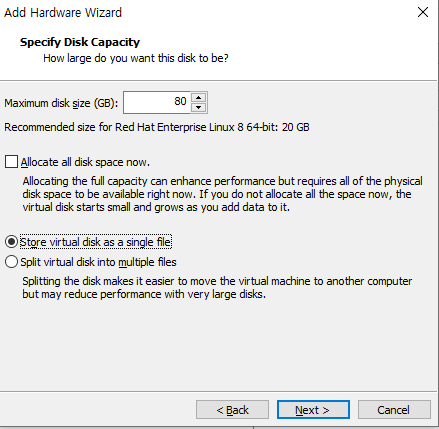

 finsh

 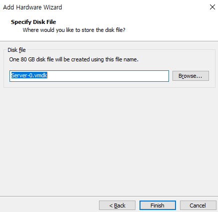

 삭제할것이 필요

 USB, 사운드, 프린터 등 삭제

 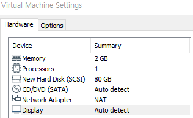

### 두번째 가상드라이브 Sever(B)

- 리눅스 운영체제, 텍스트 모드(terminal 환경)

 책39p

 똑같이 Server(B) 폴더에 Server(B) 만들기

 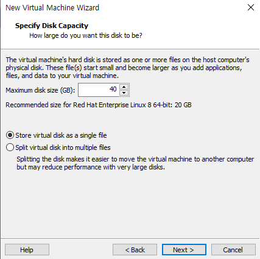

 또 설정 변경 39p 참고

 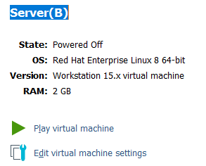

 하드디스크 생성

 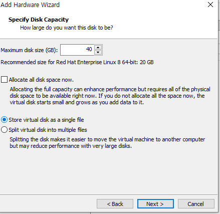

 

### 세번째 가상드라이브 WinClient

- Windows 운영체제

 똑같이 Client 폴더에 Client 만들기

 p39

 seeting 에서 다 남기고

 하드디스크는 SCASII 또는 NVMe

 이번엔 WInClient 만들기

 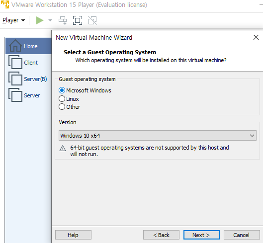

 윈도우로        

 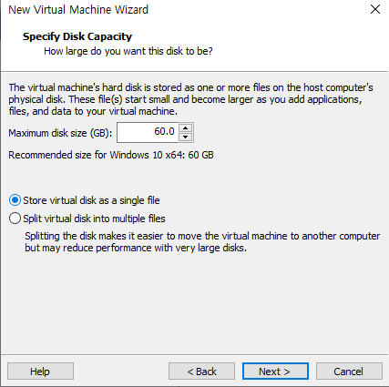

 세팅은 (하드디스크는 SCASII 또는 NVMe)

 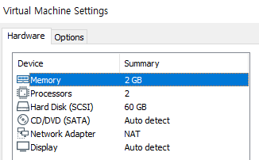

참고 사이트 : [VMware Doc](https://docs.vmware.com/en/VMware-Workstation-Player-for-Windows/15.0/com.vmware.player.win.using.doc/GUID-391BE4BF-89A9-4DC3-85E7-3D45F5124BC7.html)

참고 도서 : 
이것이 리눅스다 [다운소스](http://download.hanbit.co.kr//centos/8/)
